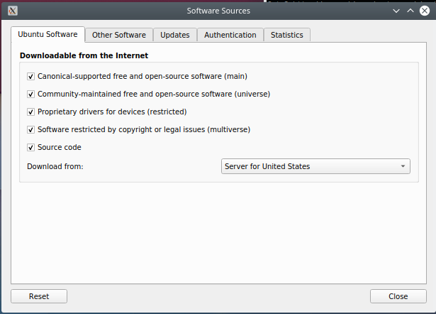

# Emacs

```bash
#!/bin/bash
```

## Introduction

Time to install everyone's favorite compute environment. We are installing from source because the Ubuntu repos lag behind the latest and greatest.

## Install Newest Emacs

Emacs in most repositories is pretty stale, let's install from source.

### Empower Apt to View and Operate on Source Code

Before we get started we need to ensure that we toggle on `Source code` as an option for `apt` to download from the internet. To do this open the program `software-properties-`. Note the dash (-) at the end, please use the one available on your system, this will differ based on your desktop environment. 

**Note:** that you may have to run this as sudo.

```bash
sudo software-properties-kde
```

The following will be presented to you. Enable the checkbox "Source code" and save.



### Clone Emacs's Source

Set a build directory

```bash
EMACS_BUILD_DIR=~/Downloads
```

Clone the repo

```bash
git clone https://git.savannah.gnu.org/git/emacs.git $EMACS_BUILD_DIR/emacs
```

Checkout the version you wish to build

```bash
cd  $EMACS_BUILD_DIR/emacs
git checkout emacs-26.1
```

### Installing Build Dependencies

Install the `build-essential` package

```bash
sudo apt install build-essential
```

Now install the dependencies for the version of emacs in the package repo

```bash
sudo apt-get build-dep emacs
```

### Building Emacs

First ensure that we are in the proper directory

```bash
cd  $EMACS_BUILD_DIR/emacs
```

Let's build this thing

```bash
./autogen.sh
./configure
make
```

Now install it

```bash
sudo make install
```

### Install Emacs Config
Clone from git.

```bash
git clone https://github.com/tracerte/emacs-config ~/.emacs.d
```
